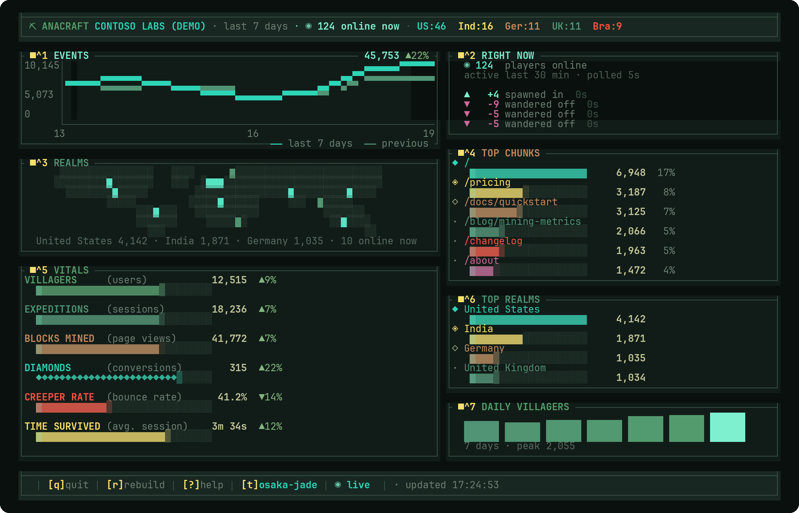

<h1 align="center">⛏ craft</h1>

<p align="center"><b>Google Analytics, mined block by block.</b></p>

<p align="center">
  A terminal dashboard for Google Analytics 4 — seven live panels, ore-textured
  bars, a realtime event feed, and achievement toasts when the numbers move.
</p>

<p align="center">
  <a href="https://anacraft.dev">anacraft.dev</a> ·
  <a href="https://github.com/mehfuzh/anacraft/releases">Releases</a> ·
  <a href="LICENSE"></a>
  <a href="https://www.rust-lang.org/"></a>
</p>

<p align="center">
  
</p>

<p align="center"><sub><code>craft dash --demo</code> · osaka-jade · 132×52</sub></p>

## Install

**macOS / Linux**

```sh
curl -fsSL https://anacraft.dev/install.sh | bash
```

Installs to `/usr/local/bin` when that is writable, otherwise `~/.local/bin` —
never with `sudo`. Set `INSTALL_DIR` to choose somewhere else:

```sh
curl -fsSL https://anacraft.dev/install.sh | INSTALL_DIR=~/bin bash
```

**From source**

```sh
cargo install --git https://github.com/mehfuzh/anacraft
```

**Manual** — grab a binary from [Releases](https://github.com/mehfuzh/anacraft/releases), extract it, and put `anacraft` on your `PATH`.

## Quick start

`anacraft` with no command opens the dashboard — `dash` is the default. With no
property saved it runs on synthetic data, so it works before you sign in.

```sh
# The dashboard, on synthetic data — no Google account needed
craft

# Connect a real GA4 property
craft login        # OAuth sign-in
craft props        # list the properties this account can read
craft use 1234567  # save it as the default

# Same bare command, now against your property
craft
```

### One-shot reports

Not everything needs a dashboard. These print and exit.

```sh
craft overview --days 30   # headline metrics, deltas, achievements
craft pages                # most-visited pages
craft portals              # where traffic arrives from
craft realms               # traffic by country
craft live                 # who is on the site right now
craft demo                 # render an overview from synthetic data
```

Two flags are global: `--property <id>` queries a property other than the saved
default, and `--theme <name>` renders with a palette other than the saved one.

### Claude Desktop

```sh
craft mcp --install          # write the server into Claude Desktop's config
craft mcp --install --demo   # ...pointed at synthetic data instead
craft mcp --uninstall        # take it back out again
```

Restart Claude Desktop and ask it how the site is doing. The block it merges in
leaves any other servers alone:

```json
{
  "mcpServers": {
    "anacraft": { "command": "/usr/local/bin/craft", "args": ["mcp"] }
  }
}
```

Needs `craft login` first and an active subscription — without either the
server still starts and its tools say which one is missing, so the client never
reports it as disconnected. `craft mcp --demo` runs on synthetic data without
either. More in [Ask an assistant](#ask-an-assistant).

## The dashboard

Seven panels, each toggleable. Turn off what you do not care about and the rest
reflows to fill the terminal.

| Key | Panel | What it shows |
|-----|-------|---------------|
| `1` | **EVENTS** | Event count per day, this period drawn over the last one, with the total and its change |
| `2` | **RIGHT NOW** | Live player count plus a spawn / wander-off event feed |
| `3` | **COUNTRIES** | Traffic plotted on a world map |
| `4` | **TOP PAGES** | Most-visited pages with view bars and rank movement |
| `5` | **VITALS** | Users, sessions, views, conversions, bounce rate, avg. session |
| `6` | **TOP COUNTRIES** | Ranked countries with tier markers |
| `7` | **DAILY USERS** | User trend across the period |

### Controls

| Key | Action |
|-----|--------|
| `1`–`7` | Toggle a panel — `e` `l` `m` `p` `v` `g` `d` do the same |
| `t` | Cycle the palette, and save it |
| `s` | Demo only — preview the Anacrafter look |
| `r` | Rebuild — force a refetch now |
| `?` / `h` | Help overlay |
| `q` / `Esc` | Quit |

## Palettes

```sh
craft theme                # list the palettes with swatches
craft theme tokyo-night    # switch and persist
craft --theme github dash  # override for one run
```

`osaka-jade` (default) · `catppuccin` · `github` · `tokyo-night` · `catppuccin-latte`

The ore vocabulary — diamond, gold, redstone, lapis — is mapped onto whichever
palette is selected, so the texture pack survives a theme swap.

The command is `craft`. `anacraft` is installed alongside it as an alias, so
older scripts and anything you have in muscle memory keep working.

## Ask an assistant

`craft mcp` serves the dashboard's numbers over the [Model Context
Protocol](https://modelcontextprotocol.io), so Claude Desktop, Claude Code, or
any MCP client can answer "how is the site doing" without a human reading a TUI.

```sh
craft mcp --install          # write the server into Claude Desktop's config
craft mcp --install --demo   # ...with `--demo` in the args it writes
craft mcp --uninstall        # take the server back out of that config
craft mcp                    # the server itself; clients spawn this, you rarely do
craft mcp --demo             # synthetic data, no Google account, no subscription
```

Claude Desktop is [one command](#claude-desktop). For Claude Code it is
`claude mcp add anacraft -- craft mcp`; any other client takes the same command
and argument. Writing a config by hand, use an **absolute path** — a desktop app
is not launched from a shell and does not inherit the `PATH` where `craft`
works. `which craft` gives the value to paste.

| Tool | Answers |
|------|---------|
| `site_status` | Headline metrics against the period before, the daily user series, and the achievements that fired |
| `live_visitors` | Who is on the site right now, by country |
| `list_pages` | Most-visited pages |
| `list_events` | Events by count, with the per-day total against the previous period |
| `list_referrers` | The URLs sending traffic |
| `list_traffic_sources` | GA4 source / medium pairs |
| `list_countries` | Traffic by country |
| `list_properties` | Every property this account can read |
| `search_pages` | Pages whose path contains a substring |
| `search_events` | Events whose name contains a substring |

Every tool takes an optional `property` and falls back to the saved default, so
an assistant that knows nothing about your config still gets answers. Responses
are structured JSON — labelled numbers carrying the property id and the date
window they cover, not rendered panels.

**Read-only.** Nothing here starts an OAuth flow, writes to `~/.anacraft/`, or
changes the default property: `login` and `use` stay human-only commands. If no
credentials are stored the tools say to run `craft login` rather than opening a
browser inside your client's subprocess. Identical reports
are cached for a minute so a chatty agent does not burn the GA4 quota that the
dashboard needs.

**Subscription.** `craft mcp` needs an active subscription — `craft subscribe`
for $2.99/month or `craft subscribe --annual` for $29/year. It opens Stripe,
waits for the payment to clear, and writes `supporter = true` itself; the
dashboard and the MCP server re-check on launch and keep that line current. The
record is keyed to the Google account you signed in with, so a second machine
only has to `craft login` — add `--check` to look it up without opening a
browser. Missing it does not take the process
down: an MCP client reads an early exit as "server disconnected", which says
nothing about what to fix, so the server starts, the handshake succeeds, and
every tool call answers with the sentence that gets you unstuck. The same goes
for a missing login. `craft mcp --demo` is ungated, so the server can be wired
up and looked at first.

## Configuration

| File | Purpose |
|------|---------|
| `~/.config/anacraft/config.toml` | Properties and their settings |
| `~/.anacraft/token.json` | OAuth refresh token, written by `login` |

Config honours `$XDG_CONFIG_HOME`. Tokens stay out of `~/.config` on purpose —
that directory ends up in dotfile repos, and a refresh token has no business
travelling with it. A pre-0.4 `~/.anacraft/config.json` is migrated on first run.

### Multiple properties

`craft use <id>` adds a property rather than replacing the last one, so the
config accumulates. In the dashboard, `tab` cycles between them.

```toml
active = "397412345"
theme  = "osaka-jade"        # palette for any property that doesn't name one

[[property]]
id           = "397412345"
name         = "anacraft.dev"
label        = "site"        # shown instead of name in the switcher
theme        = "catppuccin"
days         = 14
refresh      = 60
live_refresh = 5

[[property]]
id = "88820011"              # everything optional: inherits the defaults
```

Every key under `[[property]]` is optional and falls back to the global default,
so switching to a property that saved nothing lands on the defaults rather than
inheriting the previous property's window. Command-line flags beat both.

`ANACRAFT_PROPERTY_ID` overrides the saved property if you would rather not keep
one on disk.

### Your own OAuth client

Official builds carry one, so `craft login` works with no setup. To use your own
instead, set `ANACRAFT_OAUTH_CLIENT_ID` and `ANACRAFT_OAUTH_CLIENT_SECRET`, or
write `~/.anacraft/client.json`. Both take precedence over the built-in client,
and registering your own Google Cloud project also insulates you from other
people's quota consumption.

## Setting up GA4

The Google side — property, data stream, tag, access management, API enablement
— is documented at [anacraft.dev/setup-ga4](https://anacraft.dev/setup-ga4.html).

Cloned the repo and use [Claude Code](https://claude.com/claude-code)? The same
guide ships as a skill in `.claude/skills/google-analytics-setup/`. Ask Claude to
configure Google Analytics and it walks the console steps with you, including
tag installs per framework and what to check when nothing arrives.

`.claude/skills/anacraft/` covers this side of the line — installing, connecting
a property, driving the dashboard, wiring up `craft mcp`, and what each error
message actually means. Ask Claude to set anacraft up, or paste a failing
command at it.

## Requirements

- A Google Analytics 4 property
- A terminal with truecolor support
- Rust 1.74+, if you are building from source

## Contributing

`cargo run -- dash --demo` gets you a working dashboard with no Google account
attached. See [CONTRIBUTING.md](CONTRIBUTING.md) for the layout of the code and
what CI expects.

## License

[Apache License 2.0](LICENSE)


